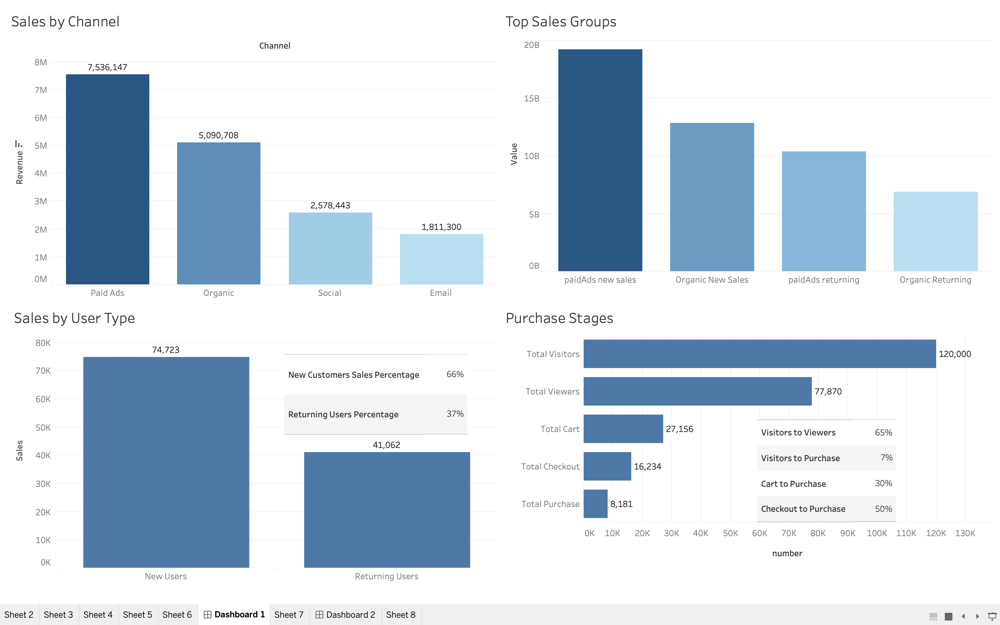

# 📊 Customer Sales Trend Analysis (SQL + Tableau)

---

## 📊 Sales Trend

## 🧠 Overview

This project analyzes customer sales performance using SQL (BigQuery) and Tableau dashboards.

The goal is to understand sales trends, customer behavior, and conversion performance across the funnel in order to generate actionable business insights.

The dataset is stored in Google BigQuery public/project dataset environment and analyzed using SQL queries, then visualized in Tableau.

---

## 🛠 Tools Used

- SQL (BigQuery) – data extraction, transformation, aggregation
- Tableau – data visualization and dashboard creation
- Google Cloud BigQuery – data warehouse

---

## 📌 Key Business Questions

This project focuses on answering:

- Which channels generate the most revenue?
- What type of customers (new vs returning) drive sales?
- Where do users drop off in the purchase funnel?
- Which part of the conversion process needs improvement?

---

## 📈 Key Insights (from Tableau Dashboard)

---

### 1. Sales by Channel

- Paid Ads: 7.5M (highest contributor)
- Organic Search: 5.0M
- Social: 2.5M
- Email: 1.8M

👉 Paid advertising is the strongest revenue driver  
👉 Organic search shows strong cost-efficient performance  
👉 Social and email act as supporting channels  

---

### 2. Customer Type & Sales

- New customers drive the majority of revenue (~66%)
- Returning customers contribute less (~37%)

👉 Strong acquisition performance  
👉 Potential weakness in retention strategy  

---

### 3. Sales Group Analysis

- Paid Ads (New): ~19B
- Organic (New): ~13B
- Paid Ads (Returning): ~10B
- Organic (Returning): ~7B

👉 Acquisition-focused strategy is highly effective  
👉 Retention segment is under-optimized  

---

### 4. Purchase Funnel Analysis

- Visitors → Viewers: 65%
- Visitors → Purchase: 7%
- Cart → Purchase: 30%
- Checkout → Purchase: 50%

👉 Major drop-off occurs before purchase stage  
👉 Checkout completion rate indicates UX/payment friction  

---

## 📉 Key Bottlenecks Identified

- Low overall conversion rate (7%)
- Drop-off between browsing and cart addition
- Moderate checkout abandonment (50%)

---

## 💡 Business Recommendations

- Improve checkout UX and payment flow
- Optimize product page engagement (view → cart)
- Strengthen retention strategy (email, loyalty, remarketing)
- Reduce friction in final purchase steps

---

## 🧾 SQL Analysis

All SQL queries used for data cleaning, aggregation, and analysis are included in the `/sql` folder.

---

## 📊 Tableau Dashboard

Dashboard visualizes:

- Sales performance by channel
- Customer segmentation (new vs returning)
- Funnel conversion analysis
- Trend over time

---

## 👤 Author

Yusei Hosoya
